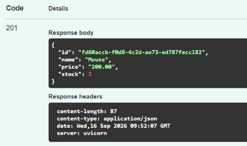
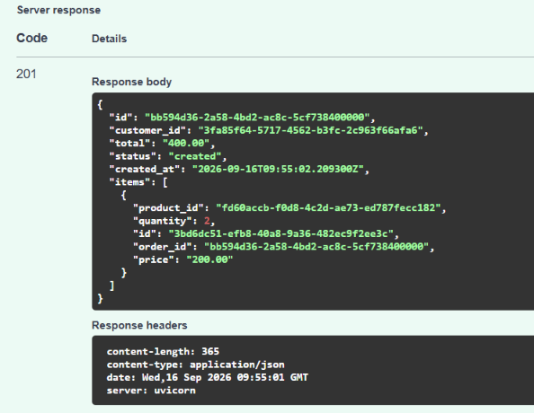
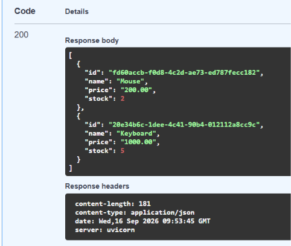
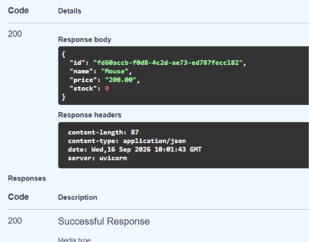
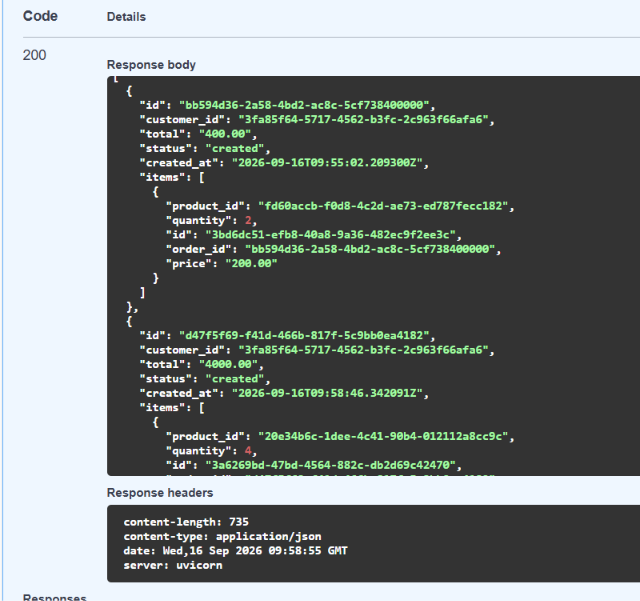
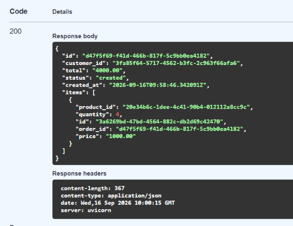

# Order Processing Service
 
A test-task implementation of an order processing API built with **FastAPI** and **async SQLAlchemy 2.x**.
 
## Stack
 
- Python 3.12+
- FastAPI
- SQLAlchemy 2.x (async, `asyncpg` driver)
- PostgreSQL 16
- Alembic (migrations)
- Docker / Docker Compose
- Poetry (dependency management)

## Project structure
 
The project follows a **feature-based** layout: code is grouped by domain (`products`, `orders`), and each domain module contains its own layers.
 
```
src/
├── config/
│   └── config.py          # pydantic-settings, reads .env
├── db/
│   ├── database.py        # async engine, session factory, get_db dependency
│   └── models.py          # SQLAlchemy models: Product, Order, OrderItem
├── products/
│   ├── schemas.py         # ProductCreate, ProductResponse
│   ├── repository.py      # DB access for products (incl. FOR UPDATE)
│   └── routes.py          # POST/GET /products
├── orders/
│   ├── schemas.py         # OrderCreate, OrderResponse, OrderItemCreate/Response
│   ├── repository.py      # DB access for orders/order items
│   ├── service.py         # business logic (create_order orchestration)
│   └── routes.py          # POST/GET /orders
└── main.py                # FastAPI app, router registration
alembic/                   # migrations
docker-compose.yml
Dockerfile
```
 
**Why this structure:** each domain's router, schemas, repository and service live together, so all logic for "orders" is in one place rather than spread across shared `routes/`, `schemas/`, `repository/` folders. This scales better as the number of domains grows and keeps related code easy to find.
 
**Layers, in one sentence each:**
- **Router** — accepts the HTTP request/response, no business logic.
- **Service** — orchestrates the business logic (validation, calculations, multi-step flows).
- **Repository** — plain database operations (select/insert), no decision-making.
- **Schemas (Pydantic)** — validate incoming data and shape outgoing responses.

## How to run
 
1. Copy `.env.example` to `.env` and fill in the values.
2. Start everything with:
```bash
   docker compose up --build
```
3. Apply database migrations (first run only, or after any model change):
```bash
   docker compose exec app alembic upgrade head
```
4. Open the interactive API docs: [http://localhost:8000/docs](http://localhost:8000/docs)

## Implemented features
 
- `POST /products/` — create a product (name, price, stock)
- `GET /products/` — list products
- `GET /products/{id}` — get a single product
- `POST /orders/` — create an order:
  - validates that every product exists and has enough stock
  - calculates the order `total` using `Decimal` 
  - stores the product's price in `order_items` as a **snapshot** at the time of purchase, so later price changes don't affect historical orders
  - requires an `Idempotency-Key` header — a repeated request with the same key returns the original order instead of creating a duplicate
- `GET /orders/{id}` — get a single order
- `GET /orders/` — list orders

## Concurrency handling
 
When two requests try to buy the last unit of the same product at the same time, a naive read-then-write can oversell stock (classic race condition).
 
This is handled with `SELECT ... FOR UPDATE` on the product row (`read_product_for_update` in `products/repository.py`). The first transaction to reach the row locks it until it commits (or rolls back); any concurrent transaction trying to read the same row for update has to wait, and will then see the already-updated stock value — preventing the same unit from being sold twice.
 
## Transaction safety / rollback
 
The `get_db` dependency wraps the session in a `try/except` that calls `session.rollback()` if any exception is raised while the session is in use, so a failure partway through `create_order` (e.g. the second item in a multi-item order is out of stock) does not leave partially-applied changes (like a decremented stock on an earlier item) committed to the database.
 
## What is not implemented

Due to time constraints, the following features were left out:

- **Kafka & Outbox Worker** 
- **Automated tests**
- **Bonus features** 

## Screenshots
 
 
 
 


